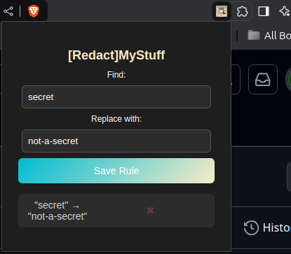

# [Redact]MyStuff 😾

   

## Getting started

**RedactMyStuff** is a browser extension that enables you to predefine a set of strings to replaced with whatever you set.

Imagine you use an AI Service such **OpenAI ChatGPT** or **DeepSeek Online Model**, and you need to paste something in your prompt which may considered as private or a company secret, you can use RedactMyStuff to replace it with something else.. dump data ?! whatever suits you.

## Setup Methods:

### 1- Setup via .crx file:

1. **Download the `.crx` file** for the [extension](https://gitlab.ciphersa.net/tdr/dfir/redactmystuff/-/blob/main/RedactMyStuff.crx).
2. Open Chrome and go to:  
   👉 `chrome://extensions/`
3. Enable **Developer Mode** (toggle in the top-right corner).
4. **Drag and Drop** the `.crx` file **into the Chrome Extensions page**.
5. Click **"Add Extension"** when prompted.
6. Enable & Pin the extension on the toolbar.

### 2- Setup via repository files:

1. git clone the repository.
1. Open **Chrome** and go to:  
   👉 `chrome://extensions/`
2. Enable **Developer Mode** (toggle in the top-right corner).
2. Click **"Load Unpacked"** and select the cloned repository extension folder.
3. Enable & Pin the extension on the toolbar.

## 🎉 **Done!** The extension is now installed.

### ToDo:

- Fix Cursor Misplacement.